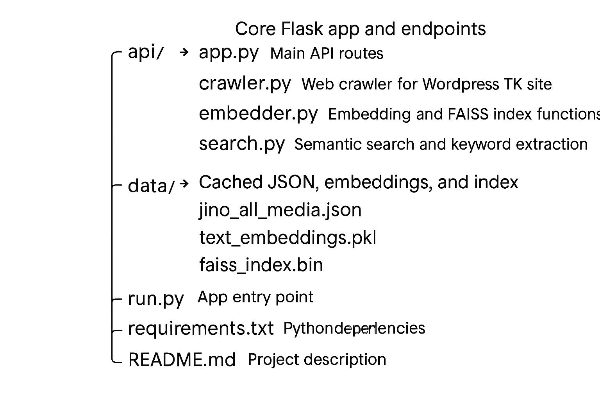

# Jino Traditional Knowledge Multimodal RAG System

This project implements a lightweight Multimodal Retrieval-Augmented Generation (RAG) system for the digital preservation and semantic search of traditional knowledge (TK) among the Jino ethnic group in Yunnan, China.

It combines web scraping, multilingual text embedding, vector indexing, and LLM-based generation to provide culturally sensitive and accessible retrieval of multimodal knowledge resources (text, image, audio).

## Project Features

- LAMP-hosted WordPress website for TK content storage  
- Python-based crawler to extract multimedia data into JSON  
- Text embeddings using `moka-ai/m3e-base` multilingual model  
- Fast semantic search using FAISS vector index  
- GPT-4 powered chatbot for natural language interaction  
- Flask + Docker + Cloudflare Tunnel for deployment and UI  

## Directory Structure



## Quick Start

### 1. Clone this repository

```bash
git clone https://github.com/your-username/jino-rag.git
cd jino-rag
```

### 2. Create a `.env` file

```bash
echo "OPENAI_API_KEY=your_openai_api_key" > .env
```

### 3. Install dependencies

```bash
pip install -r requirements.txt
```

### 4. Run the Flask app

```bash
python run.py
```

Then visit [http://localhost:5000](http://localhost:5000) in your browser.

To expose it externally, you can use tools like [Cloudflare Tunnel](https://developers.cloudflare.com/cloudflare-one/connections/connect-apps/).

---

## Refresh Data

To re-crawl the website and regenerate embeddings and FAISS index:

```bash
curl http://localhost:5000/refresh
```

---

## Live Demo (Optional)

You can visit the deployed project at:  
🔗 https://jino-lan.site/

Or access the repository:  
🔗 https://github.com/your-username/jino-rag

---

## Acknowledgements

- OpenAI GPT-4  
- `moka-ai/m3e-base`  
- FAISS by Facebook AI  
- BeautifulSoup  

---

## License

This project is licensed under the MIT License.
